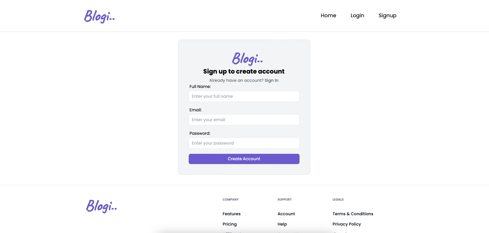
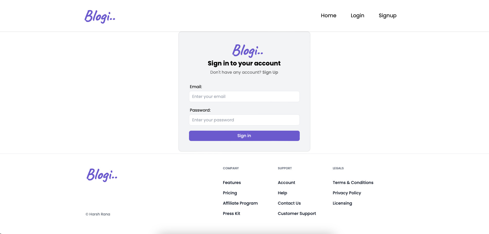
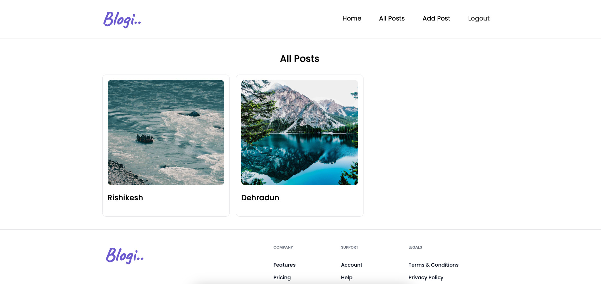
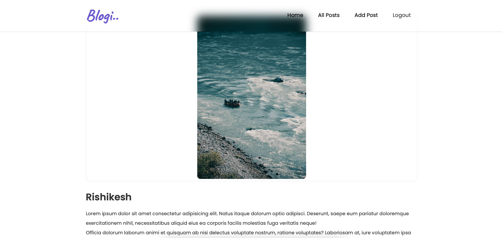
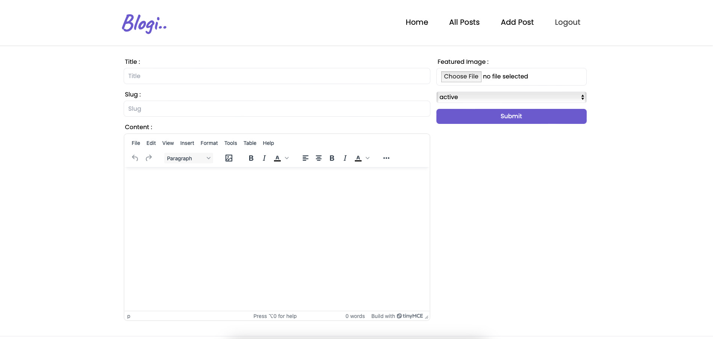

# Blogi
Blogi is a blogging platform where users can log in, post blogs, and read blogs from others. The project focuses primarily on frontend development, ensuring a smooth and responsive user experience with production-level code.


##  Table of Contents
- Features
- Technologies Used
- Environment Variables
- Installation
- Screenshots
- Acknowledgements

## Features
- Blog Posting: Users can create and publish blog posts using a rich text editor.
- Blog Reading: Browse and read blog posts from other users.
- User Authentication: Secure login and authentication using Appwrite.
- Profile Management: Manage personal information and view posted blogs.
- Responsive UI: A user-friendly and responsive interface for a seamless experience.

## Technologies Used
- React: Library for building user interfaces and managing user interactions.
- Redux: State management for maintaining global application state.
- Appwrite: Backend-as-a-service (BaaS) used for handling authentication and data storage.
- React Forms: Library used for creating and managing forms efficiently.
- TinyMCE: Rich text editor for creating and editing blog content.
- Other: HTML, CSS, JavaScript

## Environment Variables

To run this project, you will need to add the following environment variables to your .env file

`VITE_APPWRITE_UR`

`VITE_APPWRITE_PROJECT_ID`

`VITE_APPWRITE_DATABASE_ID`

`VITE_APPWRITE_COLLECTION_ID`

`VITE_APPWRITE_BUCKET_ID`

`VITE_TINYMCE_API_KEY`


## Installation

1. Clone the repository:

```bash
  git clone https://github.com/i-harsh-rana/Blogi.git
  cd Blogi
```
2. Install dependencies:
```bash
  npm install
```

3. Run the application:

```bash
  npm run dev
```


## Screensorts

Home Page:


Singup Page:





Login Page:





Explore Page:





Blog Page: 





Post Blog Page: 





## Acknowledgements

- MERN Stack community for their resources and support.
- Cloudinary for media management and optimization tools.
- Redux Toolkit for simplifying state management.
